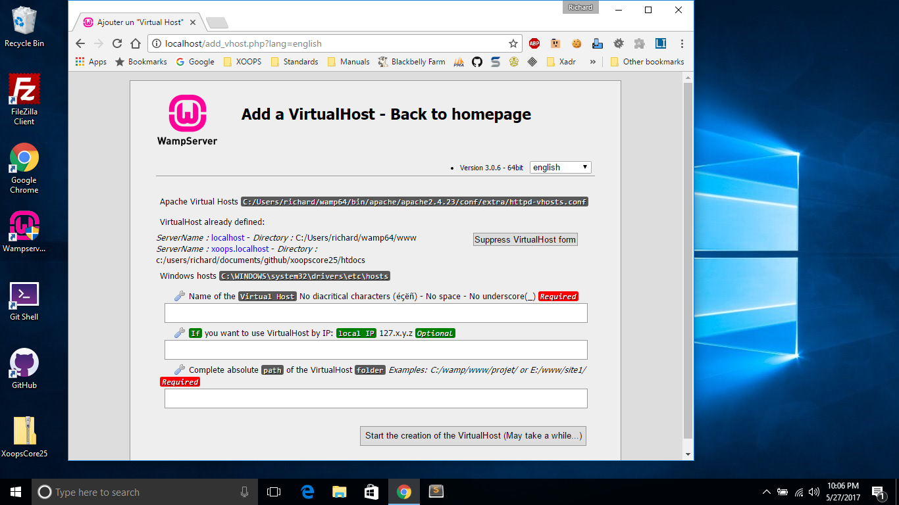

# Notes for Developers

While the actual installation of XOOPS for development use is similar to the normal installation already described, there are key differences when building a developer ready system.

One big difference in a developer install is that instead of just focusing on the contents of the _htdocs_ directory, a developer install keeps all of the files, and keeps them under source code control using git.

Another difference is that the _xoops\_data_ and _xoops\_lib_ directories can usually remain in place without renaming, as long as your development system is not directly accessible on the open internet \(i.e. on a private network, such as behind a router.\)

Most developers work on a _localhost_ system, that has the source code, a web server stack, and any tools needed to work with the code and database.

You can find more information in the [Tools of the Trade](tools.md) chapter.

## Git and Virtual Hosts

Most developers want to be able to stay up to date with current sources, and contribute changes back to the upstream [XOOPS/XoopsCore25 repository on GitHub](https://github.com/XOOPS/XoopsCore25). This means that instead of downloading a release archive, you will want to [fork](https://help.github.com/articles/fork-a-repo/) a copy of XOOPS and use **git** to [clone](https://help.github.com/categories/bootcamp/) that repository to your dev box.

Since the repository has a specific structure, instead of _copying_ files from the _htdocs_ directory to your web server, it is better to point your web server to the htdocs folder inside your locally cloned repository. To acomplish this, we typically create a new _Virtual Host_, or _vhost_ that points to our git controlled source code.

In a [WAMP](http://www.wampserver.com/) environment, the default [localhost](http://localhost/) page has in the _Tools_ section a link to _Add a Virtual Host_ which leads here:



Using this you can set up a VirtualHost entry that will drop right into your \(still\) git controlled repository.

Here is an example entry in `wamp64/bin/apache/apache2.x.xx/conf/extra/httpd-vhosts.conf`

```text
<VirtualHost *:80>
    ServerName xoops.localhost
    DocumentRoot "c:/users/username/documents/github/xoopscore25/htdocs"
    <Directory  "c:/users/username/documents/github/xoopscore25/htdocs/">
        Options +Indexes +Includes +FollowSymLinks +MultiViews
        AllowOverride All
        Require local
    </Directory>
</VirtualHost>
```

You might also need to add an entry in `Windows/System32/drivers/etc/hosts`:

```text
127.0.0.1    xoops.localhost
```

Now, you can install on `http://xoops.localhost/` for testing, while keeping your repository intact, and keeping the webserver inside the htdocs directory with a simple URL. Plus, you can update your local copy of XOOPS to the latest master at any time without having to reinstall or copy files. And, you can make enhancements and fixes to the code to contribute back to XOOPS through GitHub.

