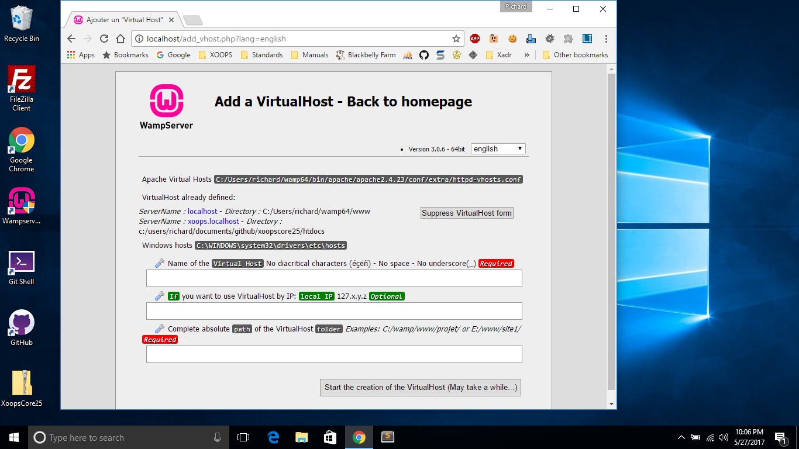

# For Developers

While the actual installation of XOOPS for development use is similar to
the normal installation already described, there are key differences when
building a developer ready system.

One big difference in a developer install is that instead of just
focusing on the contents of the *htdocs* directory, a developer install
keeps all of the files, and keeps them under source code control using git.

Another difference is that the *xoops_data* and *xoops_lib* directories
can usually remain in place without renaming, as long as your development
system is not directly accessible on the open internet (i.e. on a private
network, such as behind a router.)

Most developers work on a *localhost* system, that has the source code, a
web server stack, and any tools needed to work with the code and database.

You can find more information in the [Tools of the Trade](../tools/README.md) chapter.

## Git and Virtual Hosts

Most developers want to be able to stay up to date with current sources,
and contribute changes back to the upstream [XOOPS/XoopsCore25 repository on GitHub](https://github.com/XOOPS/XoopsCore25).
This means that instead of downloading a release archive, you will want
to [fork](https://help.github.com/articles/fork-a-repo/) a copy of XOOPS and use **git** to [clone](https://help.github.com/categories/bootcamp/) that repository to your dev box.

Since the repository has a specific structure, instead of *copying* files
from the *htdocs* directory to your web server, it is better to point your
web server to the htdocs folder inside your locally cloned repository. To
acomplish this, we typically create a new *Virtual Host*, or *vhost* that
points to our git controlled source code.

In a [WAMP](http://www.wampserver.com/) environment, the default [localhost](http://localhost/)
page has in the *Tools* section a link to *Add a Virtual Host* which leads here:


Using this you can set up a VirtualHost entry that will drop right into
your (still) git controlled repository.

Here is an example entry in `wamp64/bin/apache/apache2.x.xx/conf/extra/httpd-vhosts.conf`

```
<VirtualHost *:80>
	ServerName xoops.localhost
	DocumentRoot "c:/users/username/documents/github/xoopscore25/htdocs"
	<Directory  "c:/users/username/documents/github/xoopscore25/htdocs/">
		Options +Indexes +Includes +FollowSymLinks +MultiViews
		AllowOverride All
		Require local
	</Directory>
</VirtualHost>
```

You might also need to add an entry in `Windows/System32/drivers/etc/hosts`:
```
127.0.0.1	xoops.localhost
```

Now, you can install on `http://xoops.localhost/` for testing, while keeping your
repository intact, and keeping the webserver inside the htdocs directory with
a simple URL. Plus, you can update your local copy of XOOPS to the latest master
at any time without having to reinstall or copy files. And, you can make
enhancements and fixes to the code to contribute back to XOOPS through GitHub.
