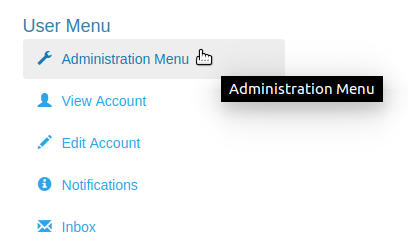
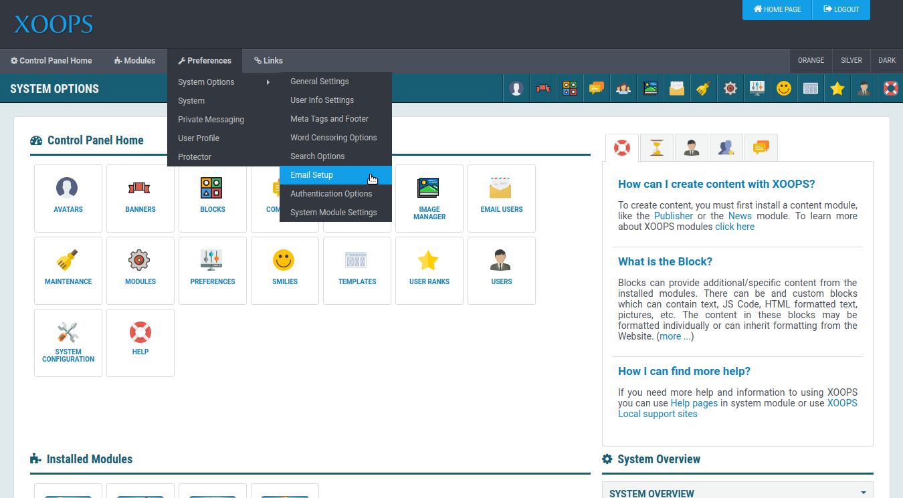

# Review System Settings

## Review System Settings

When you enter your new XOOPS system at the end of the installation process, you will arrive at a home page looking something like this.

At this point the system is a blank slate, ready for you to customize. One of the first thing you will want to do is review the system settings to make sure everything is appropriate for your requirements.

To start this review, select the _Administration Menu_ option from the _User Menu_.

Next, select _Preferences_ » _System Options_

The _System Options_ menu has several options. Here is a quick overview of what is covered in each section:

* **General Settings** - Most commonly used controls for your site, including turning site on and off for maintenance, control themes, debugging options and more.
* **User Info Settings** - Control user registration options, avatars and user name restrictions
* **Meta Tags and Footer** - Change the default information included in HTML "meta" tags and page footer
* **Word Censoring Options** - Control optional word censoring of user postings
* **Search Options** - Enable or disable site search and control search options.
* **Email Setup** - [Configure](email.md) how site email is sent
* **Authentication Options** - Optionally use AD or LDAP for authentication

