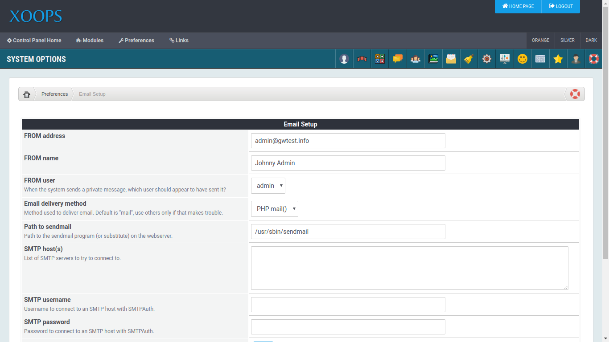

## Configure Email

XOOPS relies on email for many critical user interactions, such as validating a registration,
or resetting a password. So it is important that it be set up correctly.

Configuring site email can be very easy in some cases, and frustratingly difficult in others.

Here are some tips to help make your setup a success.

### Email Delivery Method

This section of the configuration has 4 possible values

- **PHP Mail()** - the easiest way, if it is available. Depends on the system *sendmail* program.
- **sendmail** - An industrial strength option, but often targeted for SPAM by exploiting weaknesses in other software.
- **SMTP** - Simple Mail Transfer Protocol is not usually available in new hosting accounts due to security concerns and potential for abuse. It has largely been replaced with SMTP Auth.
- **SMTP Auth** - SMTP with Authorization is usually prefered over plain SMTP. In this case XOOPS connects directly to the mail server in a more secure manner.

### SMTP Hosts

If you need to use SMTP, with or without "Auth," you will need to specify a server name here.
That name may be a simple host name or IP address, or it may include additional port and
protocol information. The simplest case would be `localhost` for a SMTP (no auth) sever running
on the same machine with the web server.

SMTP username and SMTP password are always required when using SMTP Auth. It is possible to
specify TLS or SSL, as well as a port in the XOOPS configuration field SMTP Hosts.

This could be used to connect to Gmail's SMTP: `tls://smtp.gmail.com:587`

Another example using SSL: `ssl://mail.example.com:465`

### Tips for Troubleshooting

Sometimes, things don't go as smooth as we might hope. Here are some suggestions
and resources that might help.

#### Check your hosting provider's documentation

When you establish hosting service with a provider, they should provide information about
how to access email servers. You want to have this available when you configure the email
for your XOOPS system.

#### XOOPS Uses PHPMailer

XOOPS uses the [PHPMailer](https://github.com/PHPMailer/PHPMailer) library to send email.
The [troubleshooting](https://github.com/PHPMailer/PHPMailer/wiki/Troubleshooting) section in
the wiki offers some insights.

