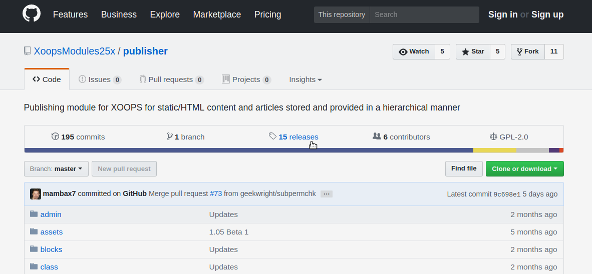
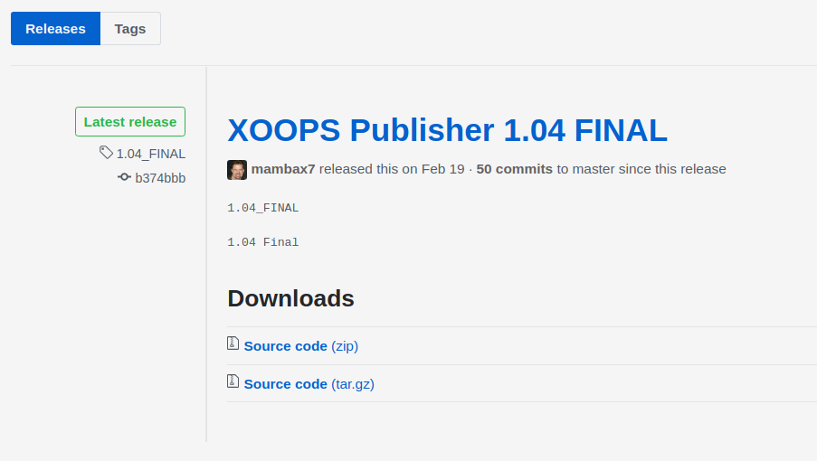
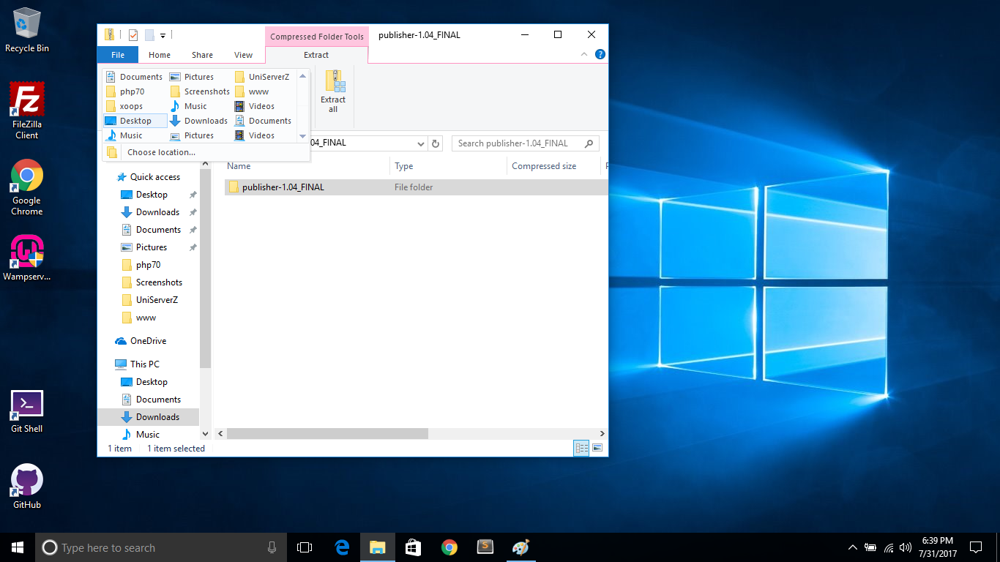
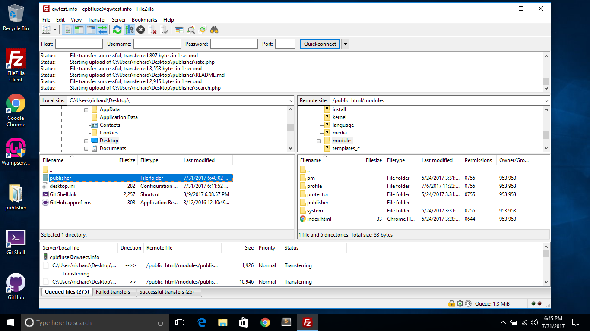
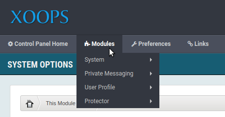
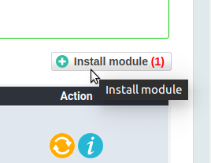
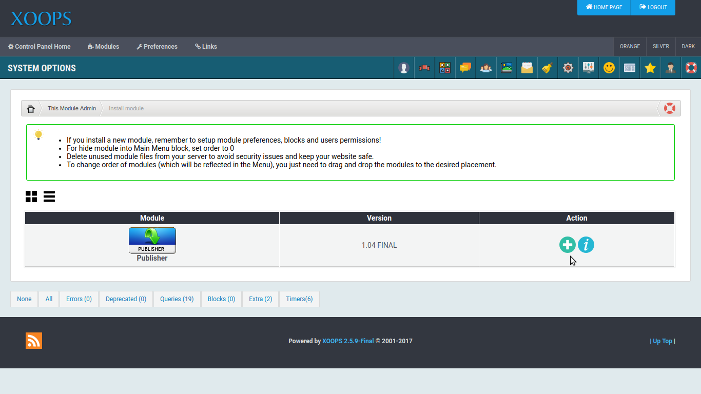
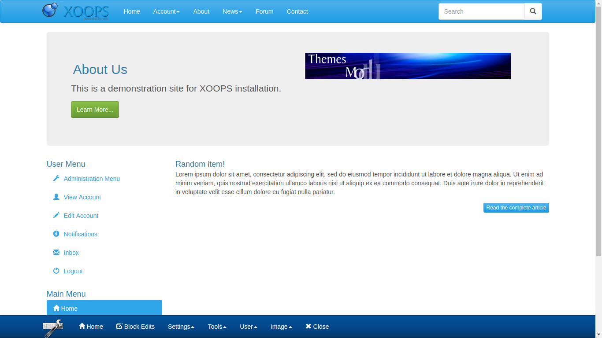

# modules

Modules are the building blocks of XOOPS systems. Modules provide specific functionality that you can easily add to your XOOPS site. Modules can add calendars, forums, image galleries, article management and more.

XOOPS maintains an "organization" consisting of modules on GitHub here: [https://github.com/XoopsModules25x](https://github.com/XoopsModules25x)

For our example, we will add an article management module called "Publisher" to a new system. Publisher can be used to manage any kind of articles. It provides a hierarchical category system to organize articles, article submission and editing, an extensive permission system to control viewing and editing rights, and article syndication using RSS.

The _publisher_ repository can be found here: [https://github.com/XoopsModules25x/publisher](https://github.com/XoopsModules25x/publisher)

## Download the Module

On GitHub, locate the _Releases_ link on the repository page.

Follow the releases tag, and locate the _Latest Release_

Download the release archive \(your prefernce of either .zip or .tar.gz flavor.\) Extract the contents of the archive.

The archive will have a name composed of the repository name \(i.e. publisher\) followed by a dash, and the release version tag. When you are preparing the extracted archive to upload to your XOOPS site, remove everything from the dash and after it from the folder name. In this case, it should just be "publisher" and not something like "publisher-v1.04\_Final".

Upload the _publisher_ directory and all of its contents to the _modules_ directory in the web root of your XOOPS installation.

Once the module files are uploaded, enter the Administration area of your XOOPS system, and select _Modules_

From the module list, select the _Install Module_ button.

This will show a list of modules which are available on your system, which have not been installed. The module install process uses instructions in the module's files to set up its requirements, such as database tables, preference options, blocks and peermissions. Once a this process is completed, the new module is availble for use.

To install _publisher_, select the install action, and confirm the install.

The system will present a report of actions taken during the installation process.

At this point, _publisher_ is installed, and ready for you to start using it. Your first steps will be to establish categories, set permissions and begin adding articles. Once you have articles, you may wish to add some blocks to highlight important or new content.

For more information on using _publisher_, please see the [XOOPS Publisher Module Tutorial](https://www.gitbook.com/read/book/xoops/publisher-tutorial).

