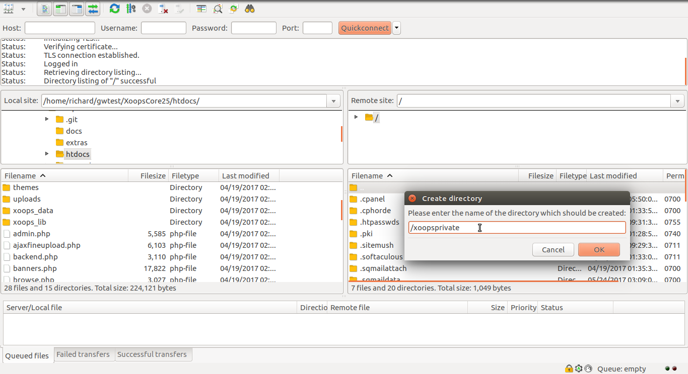
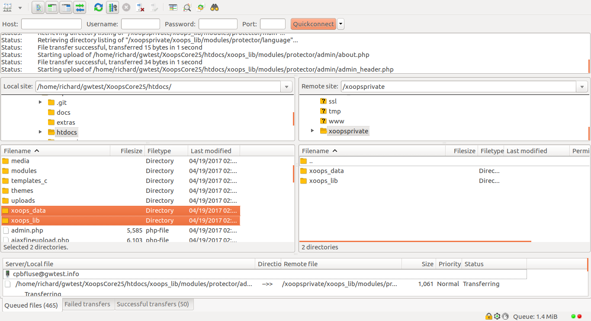
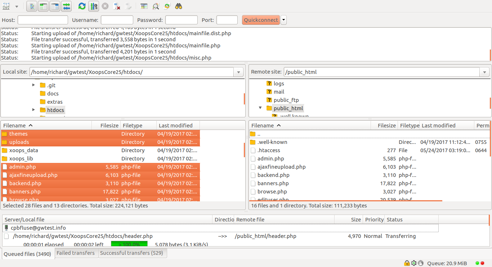

# ​Installation​

The first task in the XOOPS installation is to copy the [files you extracted](../preparations/) from the XOOPS distribution archive to your server.

## Copy the xoops\_data and xoops\_lib Directories on Your Server

* From the `htdocs` directory, copy the contents of the `xoops_data` directory to the relocated/renamed directory you have decided on.
* From the `htdocs` directory, copy the contents of the `xoops_lib` directory to the relocated/renamed directory you have decided on.

 

## Copy the Remaining Files

* Copy the remaining contents of the `htdocs` folder where it can be accessed by your server

## Make Sure These Directories and Files are writable

Normally, these will be created correctly during the _copy_ processes in the previous steps.

* mainfile.php
* uploads/  and all the files and directories it contains
* xoops\_data/ \(as relocated/renamed\) and all the files and directories it contains
* xoops\_lib/modules/protector/configs/ \(as relocated/renamed\)

## Launch the XOOPS Installer

With a web browse, access the URL to your site's web root, where you copied the contents of the distribution archive's `htdocs` directory. NOTE: Use the URL you want to use for your site here \(i.e. include _https:_ if your server is setup for SSL, and include or exclude a _www_ subdomain as appropriate.\)

The following pages describe the XOOPS installation process

* [Language Selection](step-01.md)
* [Welcome](step-02.md)
* [Configuration Check](step-03.md)
* [Path Setting](step-04.md)
* [Database Connection](step-05.md)
* [Database Configuration](step-06.md)
* [Save Configuration](step-07.md)
* [Table Creation](step-08.md)
* [Initial Settings](step-09.md)
* [Data Insertion](step-10.md)
* [Site Configuration](step-11.md)
* [Select Theme](step-12.md)
* [Modules Installation](step-13.md)
* [Welcome](step-14.md)
* [Cleanup](step-20.md)

