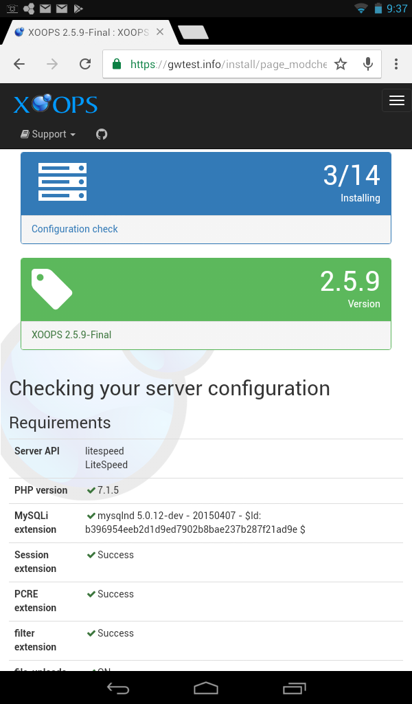

# step-03

_Checking your server configuration_ is a review of the environment the installer is running in.

If any problems are reported in the _Requirements_ section, these need to be corrected, otherwise XOOPS will _not_ work.

The _Recommended extensions_ section indicates additional PHP extensions that XOOPS, or XOOPS modules, may use to provide additional functions. You can proceed with the install, even if extensions are not available. But, if you can enable these, that is recommended.

After reviewing, select the "Continue" button to proceed.

