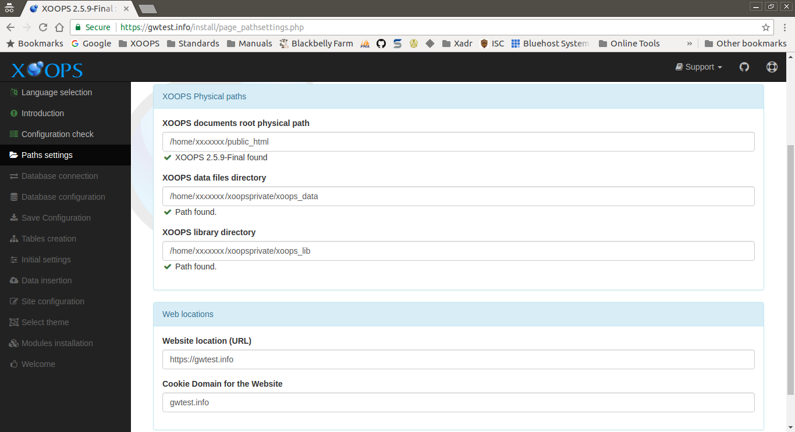
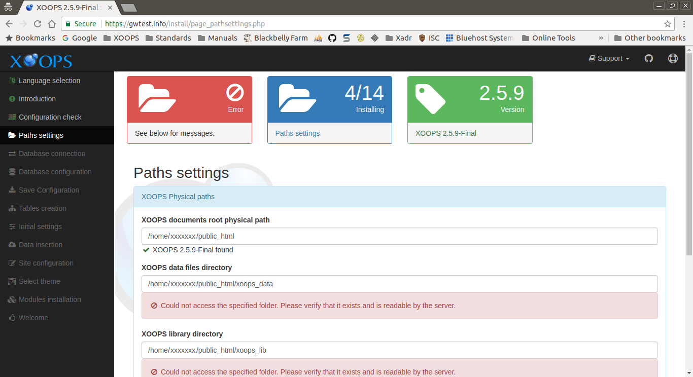
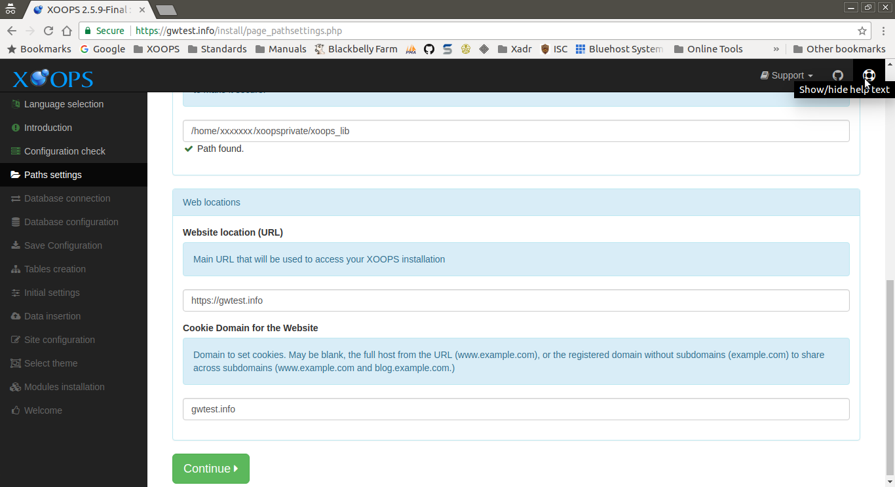

# Path Settings

This page collects the information about the file system and web address
that XOOPS needs to operate. The installer will attempt to guess this information
based on the URL you are using to access it, and the locations of the running
PHP scripts.

After reviewing and correcting any issues, select the "Continue" button to proceed.

## Data Collected in This Step
### XOOPS Physical paths
#### XOOPS documents root physical path
Physical path to the XOOPS documents (served) directory WITHOUT trailing slash

#### XOOPS data files directory
Physical path to the XOOPS data files (writable) directory WITHOUT trailing
slash. Locate the folder out of XOOPS document root to make it secure.

#### XOOPS library directory
Physical path to the XOOPS library directory WITHOUT trailing slash.
Locate the folder out of XOOPS document root to make it secure.

### Web locations
#### Website location (URL)
Main URL that will be used to access your XOOPS installation. XOOPS will
use this to build all URL inside of XOOPS. If you want an *https* site,
be sure to specify it. If you want/don't want a leading *www.* on your
site domain, be sure to specify it how you want.

This will default to the URL used to launch the installer.

#### Cookie Domain for the Website
Domain to set cookies. May be blank, the full host from the URL (www.example.com), or the registered domain without subdomains (example.com) to share across subdomains (www.example.com and blog.example.com.)

## Errors
If any of the entered paths cannot be found, an error will be displayed. Correct
any issues before continuing.

## Help
You can view extended descriptions during the install process. Selecting
the "life preserver" icon in the top corner of the page toggles the
display of the extended descriptions.

