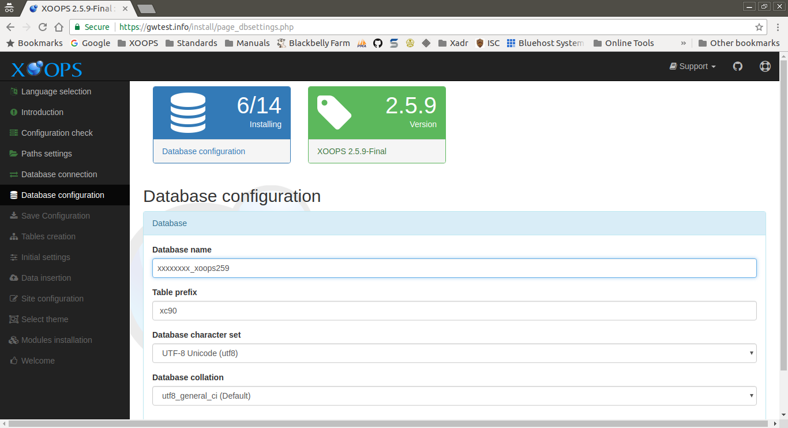

# step-06

This page collects the information about the database that XOOPS will use.

After entering the requested information and correcting any issues, select the "Continue" button to proceed.

## Data Collected in This Step

### Database

#### Database name

The name of database on the host that XOOPS should use. The database user entered in the previous step should have all privileges on this database. The installer will attempt to create this database if does not exist.

#### Table prefix

This prefix will be added to the names of all new tables created by XOOPS. This helps avoid name conflicts if the database is shared with other applications. A unique prefix also makes is more difficult to guess table names, which has security benefits. If you are unsure, just keep the default

#### Database character set

You can alter the character set that MySQL will use here, but it is _NOT_ recommended. The default is _UTF-8 Unicode_ and this will work with virtually all languages and locales.

#### Database collation

You can alter the default collation set that MySQL will use here, but it is _NOT_ recommended. The default is _utf8\_general\_ci_ and this will work well in most circumstances.

