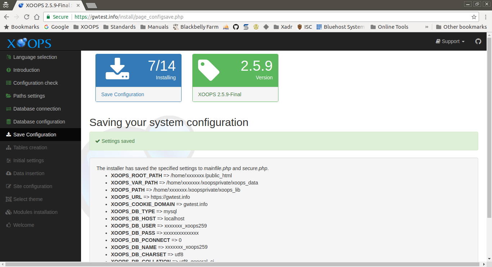
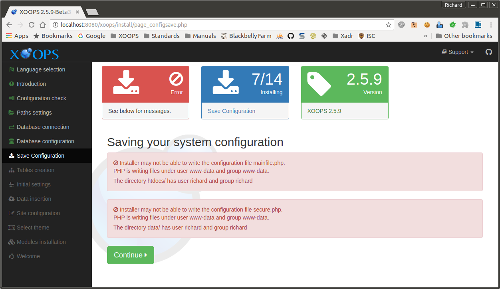

# Save Configuration

This page displays the results of saving the configuration information you
have entered up to this point.

After reviewing and correcting any issues, select the "Continue" button to proceed.

## On Success
The *Saving your system configuration* section shows the information that was saved.
The settings are saved in one of two files. One file is *mainfile.php* in the web
root. The other is *data/secure.php* in the *xoops_data* directory.



## Errors

If XOOPS detects errors in writing the configuration files, it will display
messages, detailing what is wrong.



In many cases, a default install of a Debian-derived system using mod_php
in Apache is the source of errors. Most hosting providers have configurations
that do not have these issues.

### Group permission issues
The PHP process is run using the permissions of some user. Files are also
owned by some user. If these two are not the same user, group permissions
can be used to allow the PHP process to share files with your user account.
This usually mean you need to change the group of the files and directories
XOOPS needs to write to.

For the default configuration mentioned above this means the *www-data* group
needs to be specified as the group for the files and directories, and those
files and directories need to be writable by group.

You should review you configuration carefully, and carefully choose how to
resolve these issues for a box available on the open internet.

Example commands could be:
```
chgrp -R www-data xoops_data
chmod -R g+w xoops_data
chgrp -R www-data uploads
chmod -R g+w uploads
```

### Cannot create mainfile.php
In Unix-like systems, the permission to create a new file depends on permissions
granted on the parent folder. In some cases that permission is not available,
and granting it may be a security concern.

If you have a problem configuration, you can find a dummy *mainfile.php* in the
*extras* directory in the XOOPS distribution. Copy that file into the web root
and set the permissions on the file:
```
chgrp www-data mainfile.php
chmod g+w mainfile.php
```
