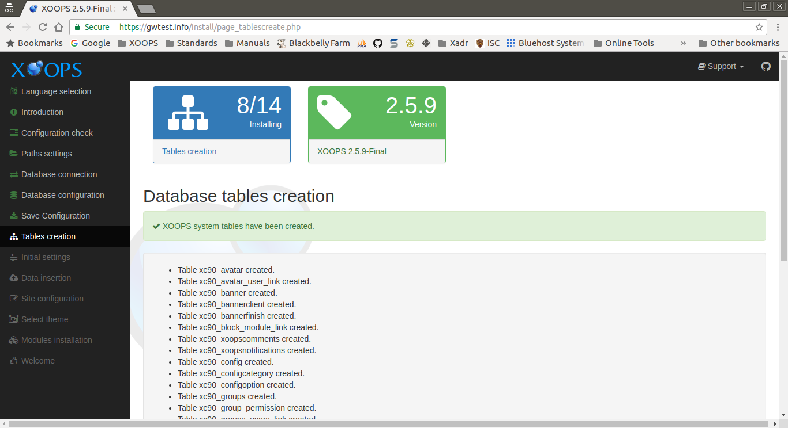

# Table Creation

This page displays the results of creating the XOOPS tables in the database.

After reviewing and correcting any issues, select the "Continue" button to proceed.

## On Success
The *Database tables creation* section shows the database tables that were
created.

## Errors
Any errors indicate issues with permission relating to the MySQL database
user account and/or MySQL database entered in previous steps. You can
return to those sections using the Database connection and Database configuration
options in the menu.