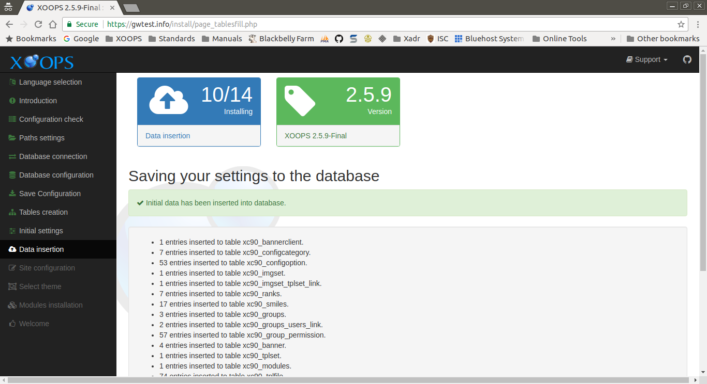

# Data Insertion

This page displays the results of creating the XOOPS tables in the database.

After reviewing and correcting any issues, select the "Continue" button to proceed.

## On Success
The *Saving your settings to the database* section shows the number of
entries inserted into the database by table.

Below this is the result of the license key generation.

