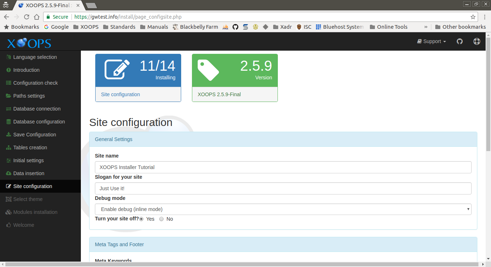

# step-11

This page collects the information used to set the intial state of your new XOOPS site. This includes things like titles and HTML meta tag values.

These are only the initial values for your site. The setting can be changed at any time in your new XOOPS site's administration preferences.

You may want to use these intial settings to limit what will be seen publicly until your site is fully set up.

After entering the requested information and correcting any issues, select the "Continue" button to proceed.

## Data Collected in This Step

### General Settings

#### Site name

The name, or title, for your site.

#### Slogan for your site

A slogan, or sub-title, for your site.

#### Debug mode

This allows you to enter your new site with debugging information displayed. While a running website should have this turned off, it can be very useful if there are any issues with the install. _Enable debug \(inline mode\)_ is the most commonly used value.

#### Turn your site off?

Select _yes_ to turn your site off. In this state, immediately after install only the newly created admin account will be able to access the site. This will allow you to configure your site to your satisfaction before allowing public access.

### Meta Tags and Footer

HTML meta tags contain data describing a site. Some modules may set page specific meta tags. The tag values entered here will be used if not overridden by page specific values.

#### Meta Keywords

A list of key words related to the site content. These may play a role in SEO, but use carefully. "Spamming" with keywords can have a negative effect on search engine placement.

#### Meta Description

A brief description of your site.

#### Meta Author

The default author of the site in the form of a name, email address, company name or URL.

#### Meta Copyright

A copyright statement for your site.

### User Info Settings

#### Allow new user registration?

Select yes to accept new user registrations, or no if registration will be private.

