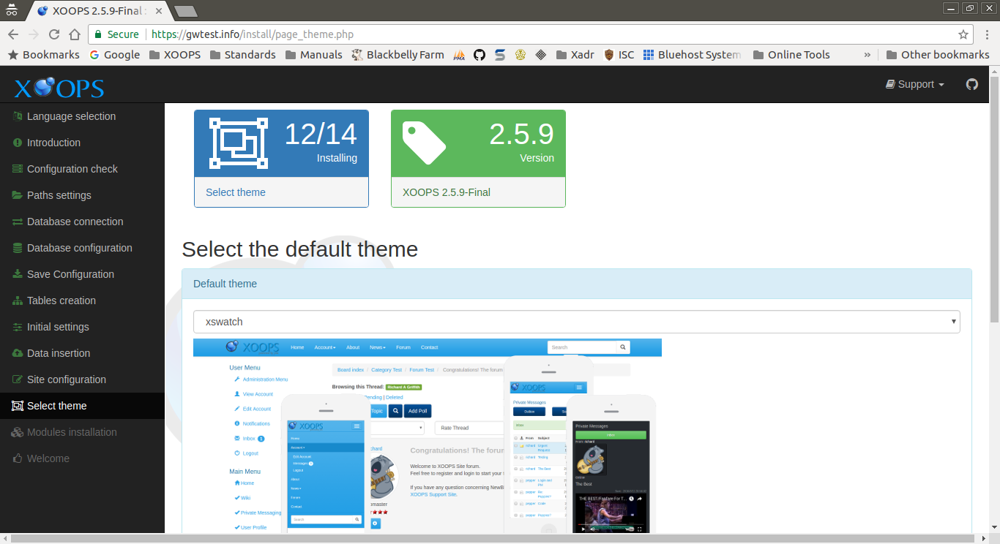

# step-12

This page collects your choice for the initial theme for your new site. Themes control the visual character of your site. Themes may be changed at any time, if desired.

After entering the requested information and correcting any issues, select the "Continue" button to proceed.

## Data Collected in This Step

### Select the default theme

#### Default theme

Select an initial theme for your site from the list. A screenshot of each theme is shown as it is selected.

