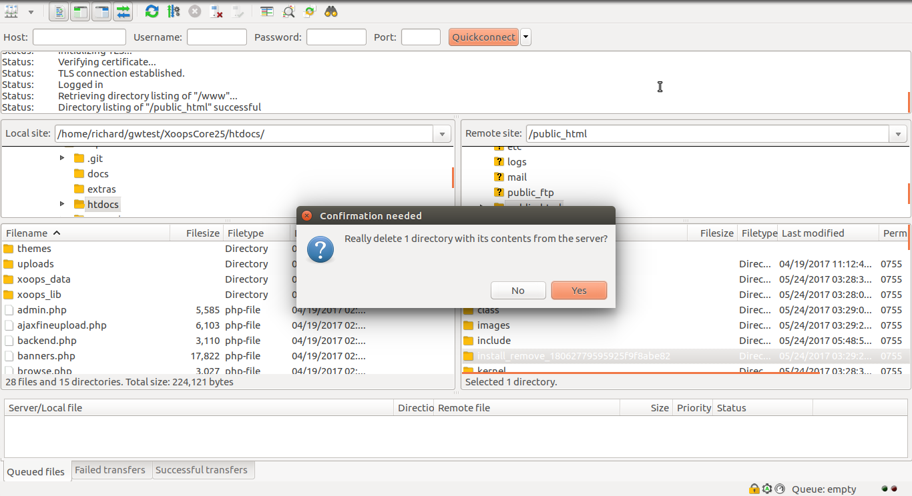

# Cleanup

For security purposes, you should remove the *install* directory from your site.
The installer will have renamed the directory to *install_remove_* followed by
some lengthy random string.

You can use an FTP client, such as FileZilla to delete the directory.

