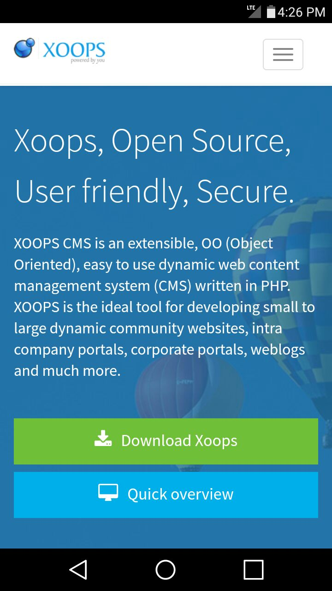

# Introduction

[XOOPS](http://xoops.org), (pronounced **/zo͞ops/**,) is a web application platform built on PHP and MySQL. It is licensed under the terms of the GNU General Public License (GPL) version 2, and is free to use, modify, and even redistribute as long as you abide by the distribution terms of the [GPL](http://www.gnu.org/licenses/gpl-2.0.html).

The [XoopsCore](https://github.com/XOOPS/XoopsCore25) is a framework intended to be extended with [modules](https://github.com/XoopsModules25x) which provide the desired application functionality.

