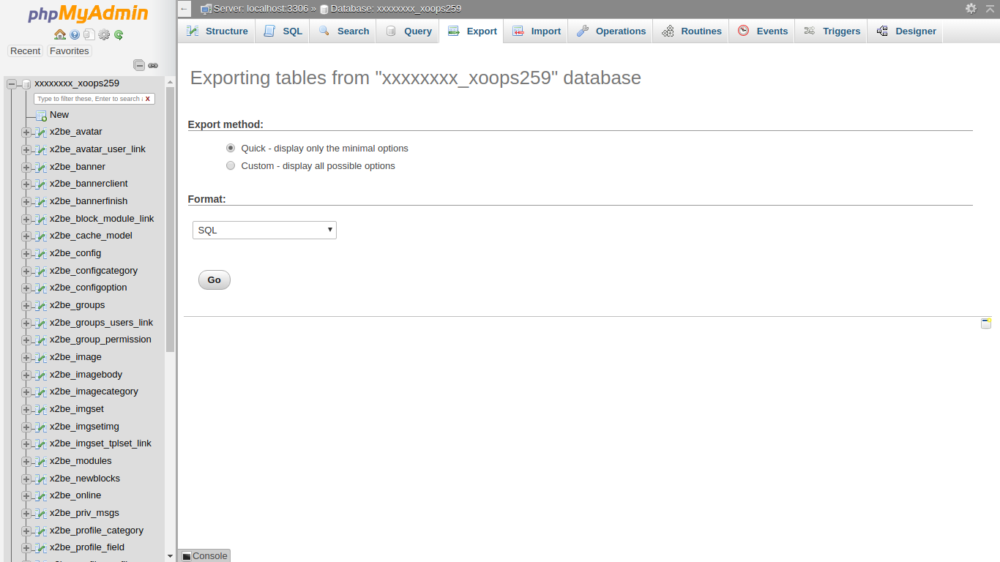
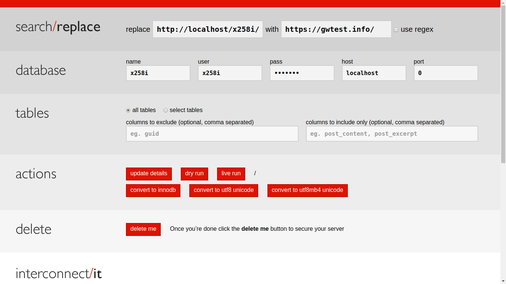
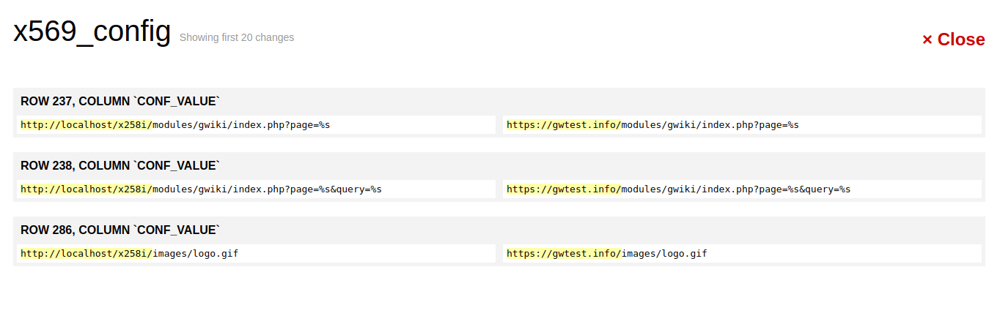

# Moving a XOOPS Site

It can be a very useful technique to prototype a new XOOPS site on a local
system or a development server. It can also be very prudent to test a XOOPS
upgrade on a copy of your production site first, just in case something goes
wrong. To accomplish these, you need to be able to move your XOOPS site from
one site to another. Here is what you need to know to successfully move your
XOOPS site.

The first step is to establish your new site environment. The same items
that are covered in the section [Advance Preparations](../preparations/README.md) apply here as well.

In review, those steps are:
- obtain hosting, including any domain name or email requirements
- obtain a MySQL user account and password
- obtain a MySQL database that above user has all privileges on

The remainder of the process is quite similar to a normal install, but:
- instead of copying the files from the XOOPS distribution, you will copy them from the existing site
- instead of running the installer, you will import a database already populated
- instead of entering answers in the installer, you will change the previous answers in the files and database

## Copy the Existing Site Files

Make a full copy of files of your existing site to your local machine where
you can edit them. If you are working with a remote host, you can use FTP
to copy the files. You need a copy to work with even if the site is running
on your local machine, just make another copy of the site's directories in that case.

It is important to remember to include the *xoops_data* and *xoops_lib*
directories even if they were renamed and/or relocated.

To make things smoother, you should eliminate cache and Smarty compiled
templates files from your copy. These files will be recreated in your new
environment, and might cause issues with old incorrect information being
retained if not cleared. To do this, delete all files, except for *index.html*,
in all three of these directories:
- *xoops_data*/caches/smarty_cache
- *xoops_data*/caches/smarty_compile
- *xoops_data*/caches/xoops_cache

## Setup the New Environment

The same items that are covered in the section [Advance Preparations](../preparations/README.md)
apply here as well. We will assume here that you have whatever hosting
you will need for the site you are moving.

### Key Information (mainfile.php and secure.php)

Successfully moving a site involves changing any references to absolute
file and path names, URLs, database parameters and access credentials.

Two files, `mainfile.php` in your site's web root, and `data/secure.php`
in your site's (renamed and/or relocated) *xoops_data* directory define
your site's basic parameters, such as its URL, where is sits in the host
file system, and how it connects to the database.

You will need to know both what the values are in the old system, and what
they will be in the new system.

#### mainfile.php

| Name | Old Value in mainfile.php | New Value in mainfile.php |
|--------------------|--------------------|--------------------|
| XOOPS_ROOT_PATH | | |
| XOOPS_PATH | | |
| XOOPS_VAR_PATH | | |
| XOOPS_URL | | |
| XOOPS_COOKIE_DOMAIN | | |

Open *mainfile.php* in your editor. Change the values for the defines shown
in the chart above from the old values, to the appropriate values for the
new site.

Keep notes of the old an new values, as we will need to make similar changes
in other places in some later steps.

As an example, if you are moving a site from your local PC to a commercial
hosting service, your values might look like this:

| Name | Old Value in mainfile.php | New Value in mainfile.php |
|--------------------|--------------------|--------------------|
| XOOPS_ROOT_PATH | c:/wamp/xoopscore25/htdocs | /home8/example/public_html |
| XOOPS_PATH | c:/wamp/xoopscore25/htdocs/xoops_lib | /home8/example/private/xoops_lib |
| XOOPS_VAR_PATH |  c:/wamp/xoopscore25/htdocs/xoops_data | /home8/example/private/xoops_data |
| XOOPS_URL | http://localhost/xoops/ | https://example.com |
| XOOPS_COOKIE_DOMAIN | localhost | example.com |

After you have changed mainfile.php, save it.

It is possible that some other files may hardcoded references to your URL
or even paths. This is more likely in customized themes and menus, but
with your editor, we can seach across all files, just to be sure.

In your editor, do a search across the files in your copy, searching for
the old XOOPS_URL value, and replace it with the new value.

Do the same for the old XOOPS_ROOT_PATH value, replacing all occurrences
with the new value.

Keep your notes, because we will have to use them again later with as we
move the database.

#### data/secure.php

| Name | Old Value in data/secure.php | New Value in data/secure.php |
|--------------------|--------------------|--------------------|
| XOOPS_DB_HOST | | |
| XOOPS_DB_USER | | |
| XOOPS_DB_PASS | | |
| XOOPS_DB_NAME | | |

Open the *data/secure.php* in the renamed and/or relocated *xoops_data*
directory in your editor. Change the values for the defines shown in the
chart above from the old values, to the appropriate values for the new site.

#### Other Files

There may be other files that may need attention when your site moves. Some
common examples are API keys for various services that may be tied to
the domain, such as:
- Google Maps
- Recaptch2
- Like buttons
- Link sharing and/or advertising such as Sharaholic, AddThis

Changing these types of associations cannot easily be automated, as the
connections to the old domain are typically part of the registration on
the service side. In some cases, this may simply add or changing the
domain associated with the service.

### Copy the Files to the New Site

Copy your now modified files to your new site. The techniques are the same
as were used during [Installation](../installation/README.md), i.e. using
FTP.

## Copy the Existing Site Database

### Backup the Database from the Old Server

For this step, using *phpMyAdmin* is highly recommended. Log in to *phpMyAdmin*
for your existing site, select your database, and choose *Export*.

The default setting are usually fine, so just select "Export method" of
*Quick* and "Format" of *SQL*.

Use the *Go* button to download the database backup.

If you have tables in your database that are not from XOOPS or its
modules, and are NOT supposed to be moved, you should select the
"Export method" of *Custom* and choose just the XOOPS related tables
in your database. (These start with the "prefix" that you specified
during the install. You can look up your database prefix in the
`xoops_data/data/secure.php` file.)

### Restore the Database to the New Server

On your new host, using your new database, restore the database using
[tools](../tools/README.md) such as the *Import* tab in *phpMyAdmin* (or *bigdump* if needed.)

### Update URLs and Paths in the Database

Update any http links to resources on your site in your database. This can
be a huge effort, and there is a [tool](../tools/README.md) to make this easier.

Interconnect/it has a product called Search-Replace-DB which can help with
this. It comes with awareness of Wordpress and Drupal environments built
in. As is, this tool can be very helpful, but it is even better when it
is aware of your XOOPS. You can find a XOOPS aware version at https://github.com/geekwright/srdb

Follow the instructions in the README.md file to download and temporarily
install this utility on your site. Earlier, we changed the XOOPS_URL define.
When you run this tool, you want to replace the original XOOPS_URL
definition with the new definition, i.e replace http://localhost/xoops
with https://example.com

Enter your old and new URLs, and choose the dry run option. Review the
changes, and if everything looks good, go for the live run option. This
step will catch configuration items and links inside your content that
refer to your site URL.

Repeat the process using your old and new values for XOOPS_ROOT_PATH.

#### Alternative Approach Without SRDB

Another way to accomplish this step without the srdb tool would be to dump
your database, edit the dump in a text editor changing the URLs and paths,
and then reloading the database from your edited dump. Yes, that process
is involved enough and carries enough risk that people were motivated to
create specialized tools such as Search-Replace-DB.

## Try Out Your Relocated Site

At this point, your site should be ready to run in its new environment!

Of course, there can always be problems. Don't be afraid to post any
questions on the [XOOPS.org Forums](https://xoops.org/modules/newbb/index.php).
