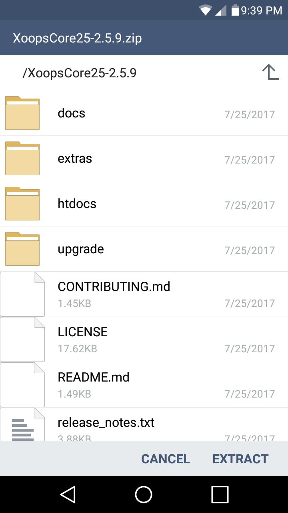

# Advance Preparations

## Taking Care of Requirements

Obtain or prepare an environment to host the XOOPS system you will install,
as detailed in [Requirements](../requirements/README.php)

- [ ] obtain hosting account
- [ ] register domain
- [ ] obtain email address for webmaster
- [ ] obtain a MySQL user account and password
- [ ] obtain a MySQL database that above user has all privileges on
- [ ] obtain and familiarize yourself with any needed [tools](../tools/README.php)

## Download XOOPS

Download the XOOPS 2.5.9 release from [GitHub](https://github.com/XOOPS/XoopsCore25/releases)

Extract the files from the downloaded archive to prepare for copying to your server.

## Decide on a Strategy

The *htdocs* directory of the XOOPS distribution contains two special directories.
- *xoops_data*
- *xoops_lib*

It is recommended that you relocate these two directories out of the web
root if possible. You should also consideer renaming these two directories
with randomized names, especially if you cannot relocate them out of the
web root directory.

**Why are these directories special?**

These directories, especially *xoops_data* contain sensitive information,
such as database credentials, or possibly sensitive cached information.

If these directories are placed unchanged into the web root (i.e. the
*public_html* directory of many hosting accounts) the directories can
easily be probed with a common web browser to verify the existence and
location of the files. Combined with other vulnerabilities, perhaps even
existing in other accounts on the same box, the sensitive information can
be disclosed. Sometimes, you will find reports of a host accidentally
introducing mis-configurations during a system upgrade, where php files
are no longer executed, and instead are served as plain text!

Relocating these directories out of the web root makes probing them with
a browser impossible. Renaming them makes finding them even more difficult.
While this is not complete protection, it is part of what you would describe
as defense in depth.

In our example install, we will adopt a strategy of moving these directories
out of the web root into a separate directory, giving us a directory
structure that looks like this:

If you can't have directories outside the web root, you can try a structure
like this:

Decide ahead of time how you are going to handle the *xoops_data* and
*xoops_lib* directories based on what options are available to you.

