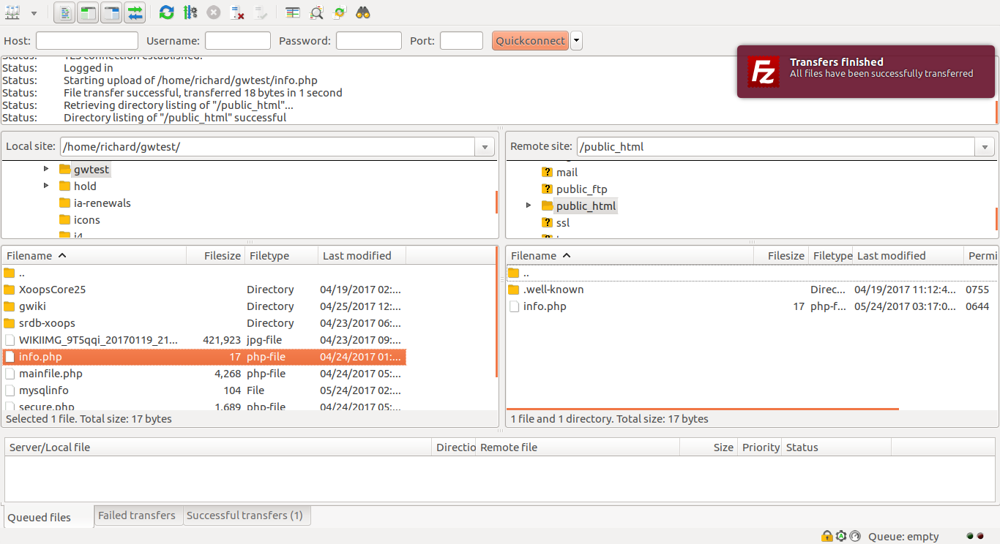
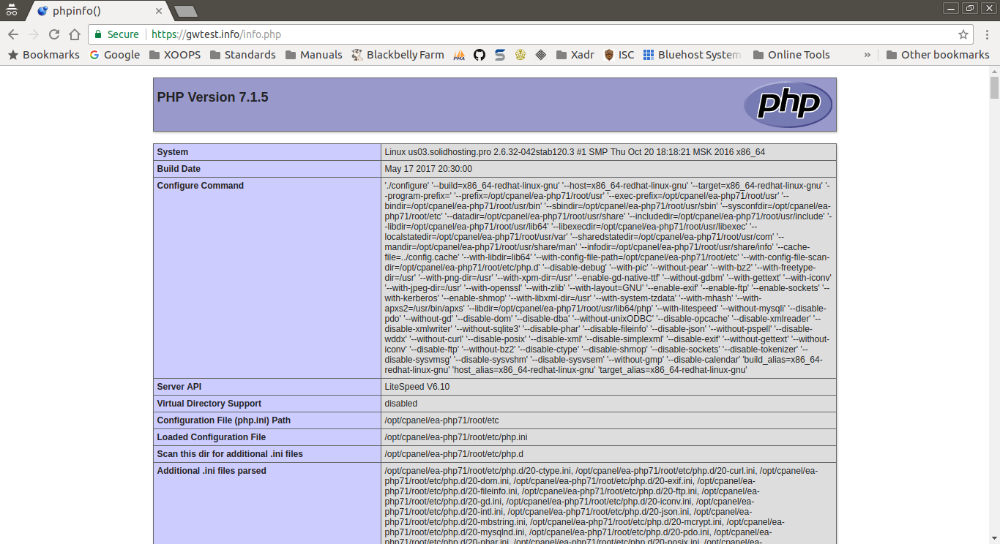

# phpinfo

This step is optional, but can easily save your hours of frustration.

As a pre-install test of the hosting system, a very small, but useful PHP script is created locally, and uploaded to the target system.

The PHP script is only one line:

```php
<?php phpinfo();
```

Using a text editor, create a file named _info.php_ with this one line.

Next, upload this file to your web root.



Access your script by opening it in your browser, i.e. accessing `http://example.com/info.php`. If everything is working correctly, you should see a page something like this:



Note: some hosting services may disable the _phpinfo\(\)_ function as a security measure. You usually will receive a message to that effect, if that is the case.

The output of the script might come in handy for troubleshooting, so consider saving a copy of it.

If the test works, you should be good to go for the install. You should delete the _info.php_ script, and proceed with the install.

If the test fails, investigate why, as whatever issue is preventing this simple test from working **will** prevent a real install from working.

