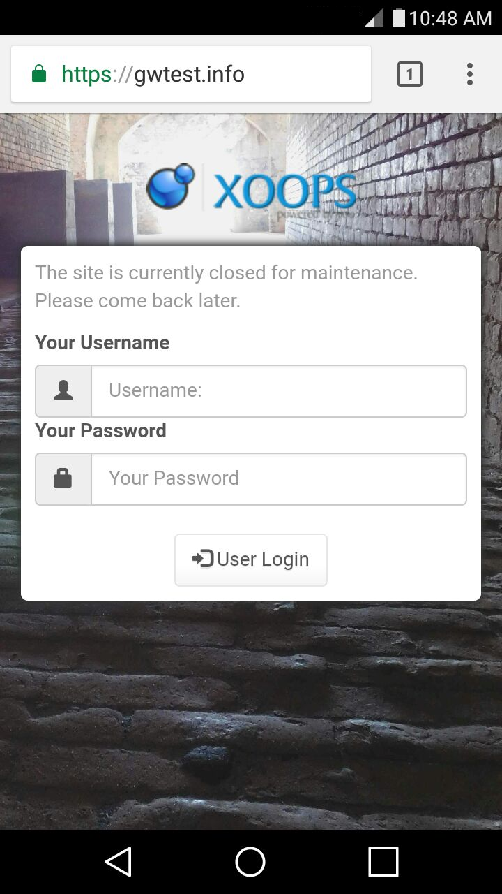
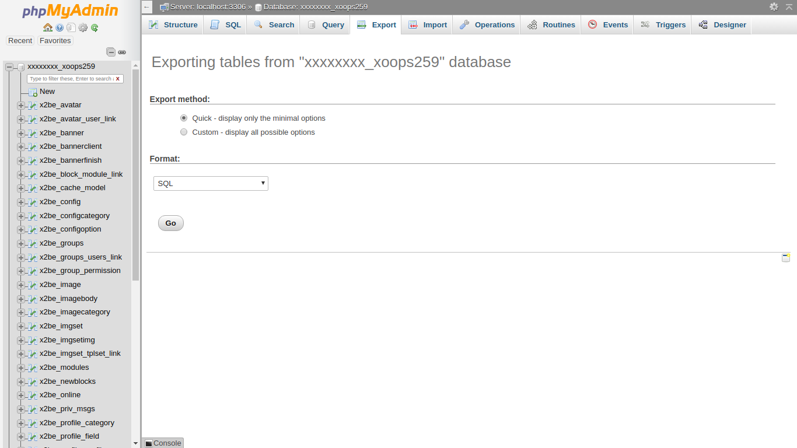

# Preparations for Upgrade

## Turn Site Off

Before starting the XOOPS upgrade proccess, you should set the "Turn your site off?"
item to *Yes* in the Preferences -> System Options -> General Settings page
in the Administration Menu.

This keeps users from encountering a broken site during the upgrade. It also
keeps contention for resources to a minimum to ensure a smoother upgrade.

Instead of errors and a broken site, your visitors will see something like this:

## Backup

It is a good idea to use the XOOPS administration *Maintenance* section to
*Clean cache folder* for all caches before making a full backup of your
site files. With the site off, using the *Empty the sessions table* is also
recommended so that if a restore is needed, the stale sessions will not be
part of it.

### Files

The file backup can be made with FTP, copying all files to your local machine.
If you have direct shell access to the server, it can be *much* faster to
make a copy (or an archive copy) there.

### Database

For making a database backup, you can use the built in functions in the XOOPS
administration *Maintenance* section. You can also use the *Export* functions
in *phpMyAdmin*, if available. If you have shell access, you can use the *mysql*
command to dump your database.

Being fluent in backing up, and *restoring* your database is an important
webmaster skill. There are many online resources that you can use to learn
more about these operations as appropriate to your installation, such as
http://webcheatsheet.com/sql/mysql_backup_restore.php

## Copy New Files to the Site

Copying the new files to your site is virtually identical to the [Preparations](../preparations/README.md)
step during installation. You should copy the *xoops_data* and *xoops_lib*
directories to wherever these were relocated during the install. Then, copy
the rest of the contents of the distribution's *htdocs* directory (with
a few exceptions covered in the next section) over the existing files and
directories in your web root.

Copy the entire *upgrade* directory from the distribution to your web root,
creating an *upgrade* directory there.

### Things You Might Not Want To Copy Over

You should not recopy the *install* directory into a working XOOPS system.
Leaving the install folder in your XOOPS installation exposes your system
to potential security issues. The installer randomly renames it, but you
should delete it and make sure you don't copy in another one.

There are some file you may have editied to customize your site, and you will
want to preserve those. Here is a list of common customizations.

- *xoops_data/configs/xoopsconfig.php* if it has been changed since the site was installed
- any directories in *themes* if customized for your site. In this case you may want to compare files to identify useful updates.
- any file in *class/captcha/* starting with "config" if it has been changed since the site was installed
- any customizations in *class/textsanitizer*
- any customizations in *class/xoopseditor*

If you realize after the upgrade that something was accidentally overwritten,
don't panic -- that is why you started with a full backup. *(You did make a backup, right?)*
