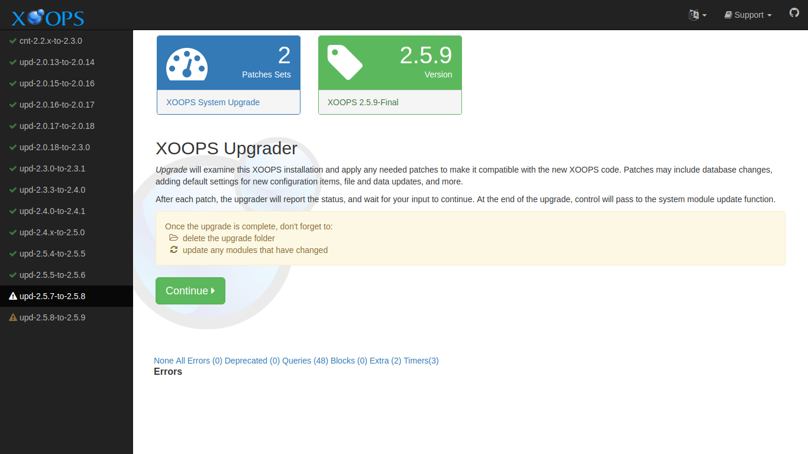
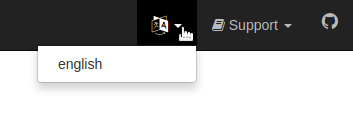
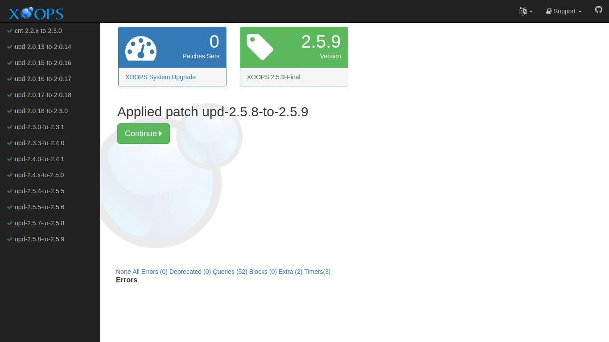

# Running Upgrade

Launch the upgrade by pointing your browser to the *upgrade* directory of your site:

```
http://example.com/upgrade/
```

This should show a page like this:


Select the "Continue" button to proceed.

## Choosing a Language
The main XOOPS distribution comes with English support. Support for additional
locales is supplied by [XOOPS Local support sites](http://www.xoops.org/modules/xoopspartners/).
This support can come in the form of a customized distribution, or additional
files to add to the main distribution.

XOOPS translations are maintained on [transifex](https://www.transifex.com/xoops/public/)

If your XOOPS Upgrader has additional language support, you can change the language
by selecting the language icon in the top menus, and choosing a different language.



