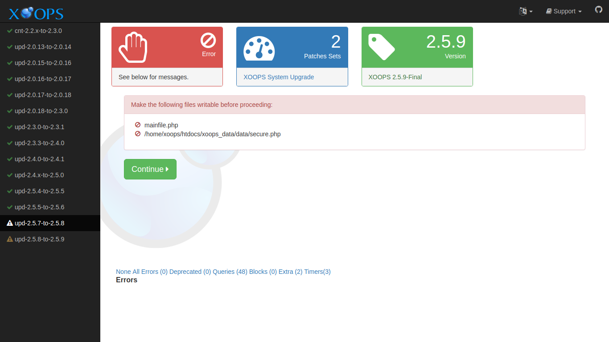
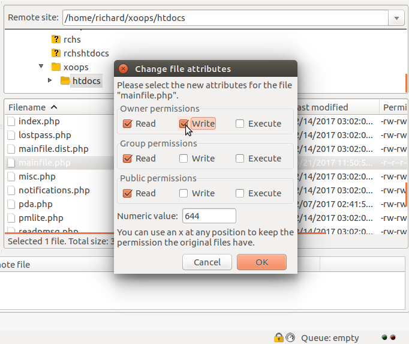

# Troubleshooting

## Permission Issues

The XOOPS Upgrade may need to write to files that have previously been
made read-only. If this is the case, you will see a message like this:



The solution is to change the permissions. You can change permissions
using FTP if you do not have more direct access. Here is an example using
FileZilla:



## Debugging Output

You can enable extra debugging output in the logger by adding a debug
parameter to the URL used to launch the Upgrade:

```
http://example.com/x258i/upgrade/?debug=1
```
