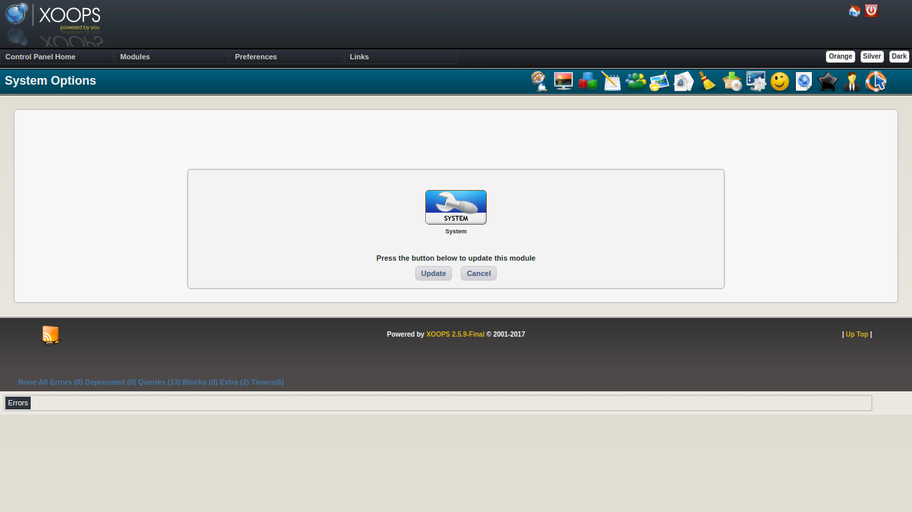
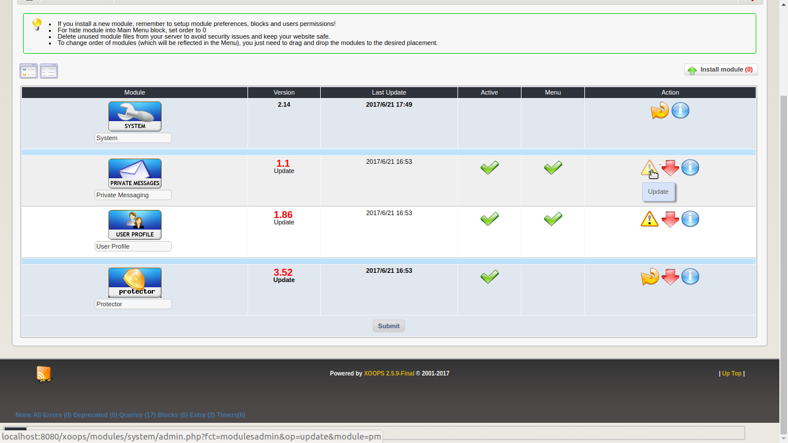

# ustep-04

## Update the System Module

After all needed patches have been applied, selecting _Continue_ will set everything up to update the **system** module. This is a very important step and is required to complete the upgrade properly.

Select _Update_ to perform the update of System module.

## Update Other XOOPS Supplied Modules

XOOPS ships with three optional modules - pm \(Private Messaging,\) profile \(User Profile\) and protector \(Protector\) You should do an update on any of these modules that are installed.

## Update Other Modules

It is likely that there are updates to other modules that might enable the modules to work better under your now updated XOOPS. You should investigate and apply any appropriate module updates.

## Open Your Site

If you followed the advice to _Turn your site off_, you should turn it back on once you have determined it is working correctly.

