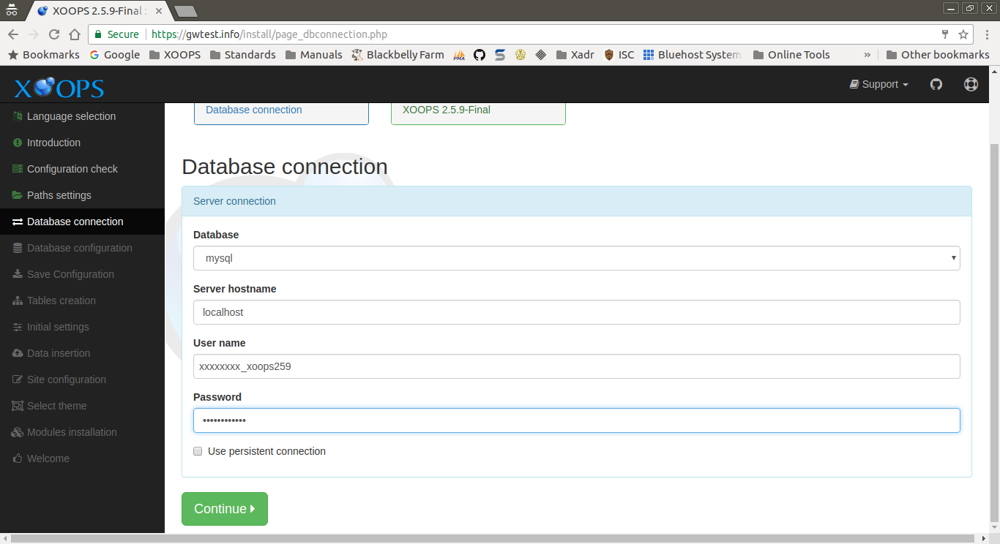

# Database Connection​

This page collects the information about about the database user account that XOOPS will use.

After entering the requested information and correcting any issues, select the "Continue" button to proceed.

## Data Collected in This Step

### Server connection

#### Database

Currently, _mysql_ is the only available option.

#### Server hostname

Hostname of the database server. If you are unsure, _localhost_ works in most cases.

#### User name

The database user account that XOOPS should use to connect to the database server.

#### Password

Password of the database user account entered above.

#### Use persistent connection

Default is 'No'. Leave this blank if you are unsure.

