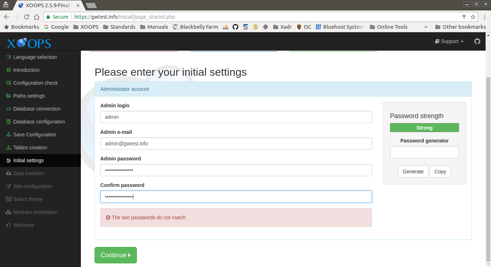

# Initial Settings​

This page collects the information used to create the primary Administrator \(AKA Webmaster\) account.

After entering the requested information and correcting any issues, select the "Continue" button to proceed.

## Data Collected in This Step

### Administrator account

#### Admin login

This will be the username used by the adminstrator to log in to the XOOPS system.

#### Admin e-mail

This the email address used by the XOOPS system to communicate with the administrator. \(Note, this is required for password recovery/reset.\)

#### Admin password

This is the password to use for the adminstrator account,

#### Confirm password

Use this field to confirm the adminstrator password. It must match the _Admin password_ field.

### Password strength

This section displays the relative strenght of the _Admin password_.

#### Password Generator

You can use this section to generate and use a random password for the account. Select _Generate_ to show a random password. Select _Copy_ to copy the generated password to _Admin password_.

