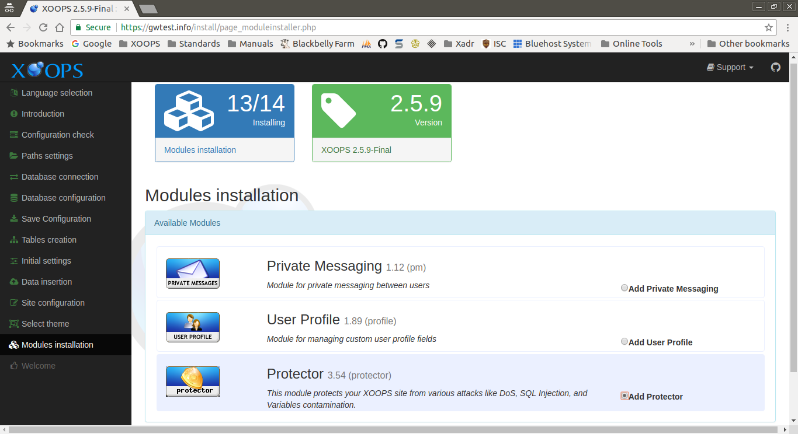

# Modules Installation​

This page collects your choice for the modules to install in your new site. Modules may be added or removed at any time, if desired.

After entering the requested information and correcting any issues, select the "Continue" button to proceed.

## Data Collected in This Step

### Available Modules

Select "Yes" to install a module. You may select none, any or all modules.

These are the modules included with a standard XOOPS install.

* Private Messaging - _enhanced private messaging between users_
* User Profile - _enhanced/custom user profiles_
* Protector - _enhanced site security, spam controls and attack mitigation_

#### Note

You can add modules to the modules directory when uploading the XOOPS files before starting the install, and they will also be available in this step.

#### Strong Recommendation

**All XOOPS sites** should install the _Protector_ module.

