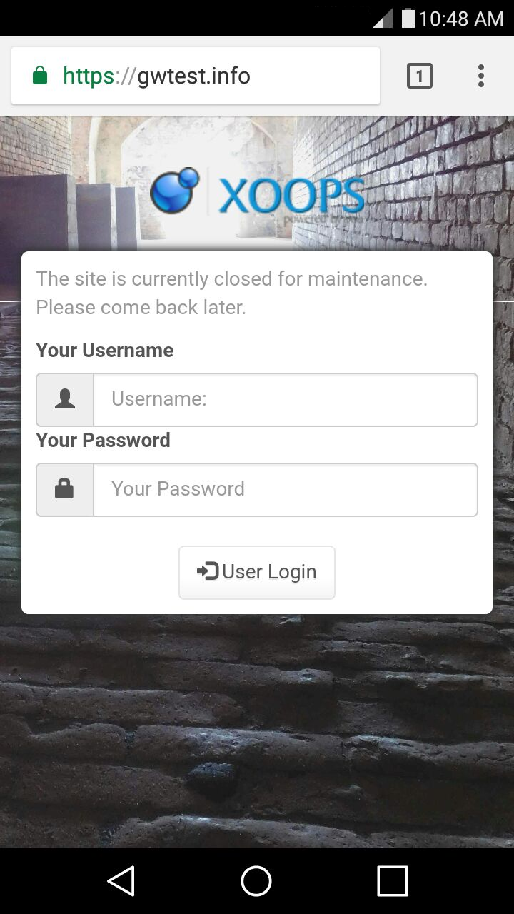

# Preparations for Upgrade​

## Turn Site Off

Before starting the XOOPS upgrade proccess, you should set the "Turn your site off?" item to _Yes_ in the Preferences -&gt; System Options -&gt; General Settings page in the Administration Menu.

This keeps users from encountering a broken site during the upgrade. It also keeps contention for resources to a minimum to ensure a smoother upgrade.

Instead of errors and a broken site, your visitors will see something like this:



## Backup

It is a good idea to use the XOOPS administration _Maintenance_ section to _Clean cache folder_ for all caches before making a full backup of your site files. With the site off, using the _Empty the sessions table_ is also recommended so that if a restore is needed, the stale sessions will not be part of it.

### Files

The file backup can be made with FTP, copying all files to your local machine. If you have direct shell access to the server, it can be _much_ faster to make a copy \(or an archive copy\) there.

### Database

For making a database backup, you can use the built in functions in the XOOPS administration _Maintenance_ section. You can also use the _Export_ functions in _phpMyAdmin_, if available. If you have shell access, you can use the _mysql_ command to dump your database.

Being fluent in backing up, and _restoring_ your database is an important webmaster skill. There are many online resources that you can use to learn more about these operations as appropriate to your installation, such as [http://webcheatsheet.com/sql/mysql\_backup\_restore.php](http://webcheatsheet.com/sql/mysql_backup_restore.php)


## Copy New Files to the Site

Copying the new files to your site is virtually identical to the [Preparations](../../installation/preparations/) step during installation. You should copy the _xoops\_data_ and _xoops\_lib_ directories to wherever these were relocated during the install. Then, copy the rest of the contents of the distribution's _htdocs_ directory \(with a few exceptions covered in the next section\) over the existing files and directories in your web root.

Copy the entire _upgrade_ directory from the distribution to your web root, creating an _upgrade_ directory there.

### Things You Might Not Want To Copy Over

You should not recopy the _install_ directory into a working XOOPS system. Leaving the install folder in your XOOPS installation exposes your system to potential security issues. The installer randomly renames it, but you should delete it and make sure you don't copy in another one.

There are some file you may have editied to customize your site, and you will want to preserve those. Here is a list of common customizations.

* _xoops\_data/configs/xoopsconfig.php_ if it has been changed since the site was installed
* any directories in _themes_ if customized for your site. In this case you may want to compare files to identify useful updates.
* any file in _class/captcha/_ starting with "config" if it has been changed since the site was installed
* any customizations in _class/textsanitizer_
* any customizations in _class/xoopseditor_

If you realize after the upgrade that something was accidentally overwritten, don't panic -- that is why you started with a full backup. _\(You did make a backup, right?\)_

## Check mainfile.php

Old versions of XOOPS \(i.e. 2.3\) required some manual changes to be made in mainfile.php to enable the Protector module. In your web root you should have a file named `mainfile.php`. Open that file in your editor and look for these lines:

```php
include XOOPS_TRUST_PATH.'/modules/protector/include/precheck.inc.php' ;
```

and

```php
include XOOPS_TRUST_PATH.'/modules/protector/include/postcheck.inc.php' ;
```

Remove these lines if you find them, and save the file before continuing.

